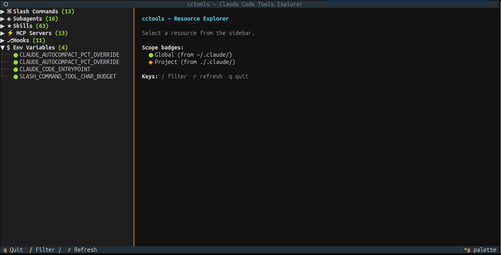
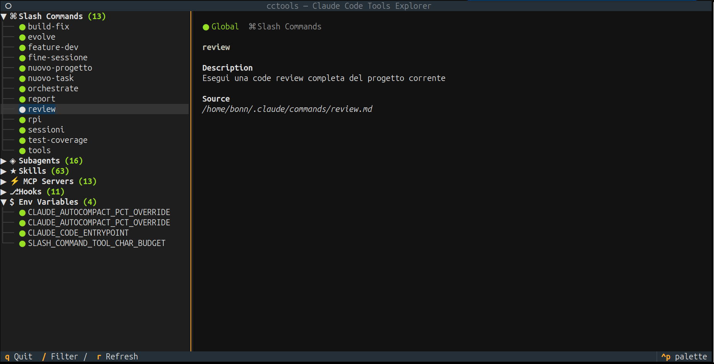
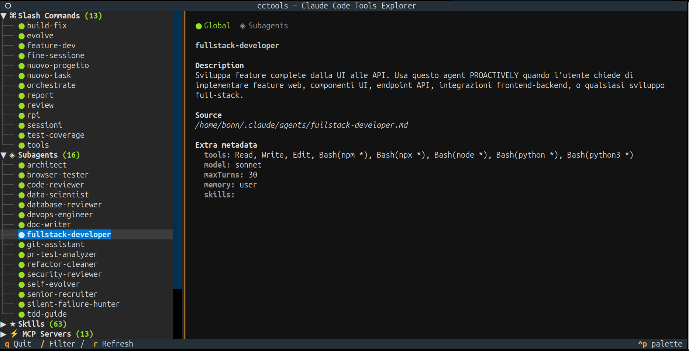
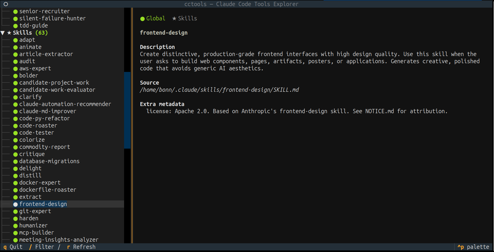
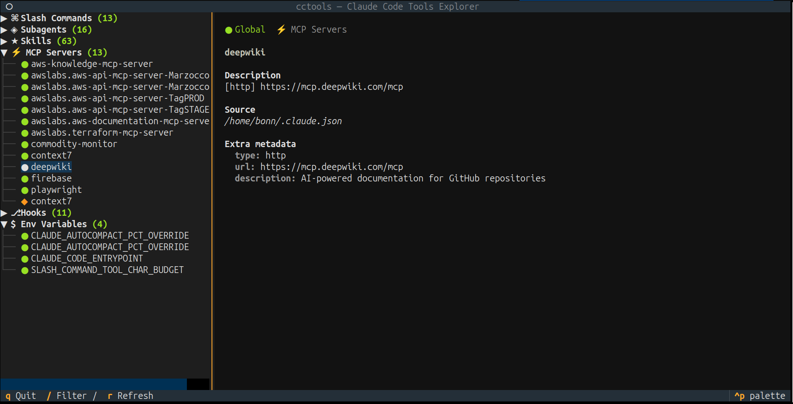
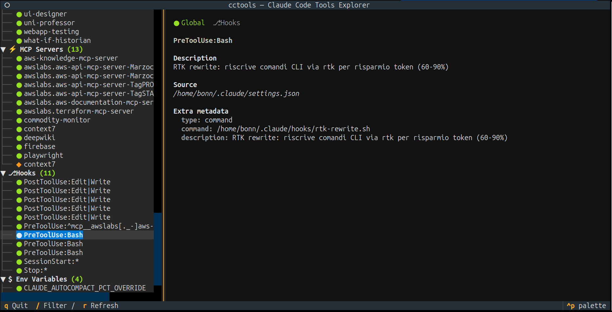

**English** | [Italiano](README.it.md)

# Claude Code Available Tools by Bonn

Interactive explorer for Claude Code tools and configuration. Scans and displays slash commands, subagents, skills, MCP servers, hooks, and environment variables from both global (`~/.claude/`) and project-level (`.claude/`) configurations.

[](https://github.com/AndreaBonn/claude-code-available-tools/actions/workflows/ci.yml)
[](https://github.com/AndreaBonn/claude-code-available-tools/actions/workflows/ci.yml)
[](https://github.com/AndreaBonn/claude-code-available-tools/actions/workflows/ci.yml)
[](https://github.com/astral-sh/ruff)
[](LICENSE)
[](SECURITY.md)



## Features

- Three display modes: full-screen TUI (Textual), inline text report (Rich), and external terminal window
- Scans global and project-level Claude Code configurations
- Visual scope indicators: green for global, yellow for project resources
- Live filtering and auto-refresh (3s interval) in TUI mode
- Minimal YAML frontmatter parser with no external YAML dependency
- Cross-platform: Linux, macOS, Windows
- Integrates as `/tools` slash command inside Claude Code sessions

<details>
<summary>Screenshots</summary>

| Slash Commands | Subagents |
|:-:|:-:|
|  |  |

| Skills | MCP Servers |
|:-:|:-:|
|  |  |

</details>

## Installation

Requires Python 3.10+ and one of: pipx, uv, or pip.

```bash
# Clone the repository
git clone https://github.com/AndreaBonn/claude-code-available-tools.git
cd claude-code-available-tools

# Run the universal installer (auto-detects OS)
./install.sh

# Or use platform-specific installers
./installers/install_linux.sh       # Linux
./installers/install_macos.sh       # macOS
.\install.bat                       # Windows
```

The installer does four things:

1. Checks for Python 3.10+
2. Installs the `cctools` package (via pipx, uv, or pip)
3. Copies the `/tools` slash command to `~/.claude/commands/tools.md`
4. Runs a smoke test

Manual installation:

```bash
pip install .
# or
pipx install .
# or
uv tool install .
```

### Platform support

| OS | TUI | Inline | External | Installer |
|----|-----|--------|----------|-----------|
| Linux | Yes | Yes | gnome-terminal, konsole, xfce4-terminal, xterm | `install_linux.sh` |
| macOS | Yes | Yes | Terminal.app via osascript | `install_macos.sh` |
| Windows | Yes | Yes | Not available | `install_windows.ps1` |

## Usage

```bash
# Auto mode (TUI if terminal >= 80 columns, otherwise inline)
cctools

# Explicit modes
cctools --mode tui
cctools --mode inline
cctools --mode external

# Filter resources by name or description
cctools --mode inline --filter mcp
```

From within a Claude Code session:

```
/tools                  # Opens TUI in external terminal
/tools inline           # Prints report in chat
/tools tui              # Opens TUI in current terminal
/tools inline mcp       # Filtered inline report
```

### TUI keybindings

| Key | Action |
|-----|--------|
| `/` | Open filter bar |
| `Escape` | Close filter, clear filter text |
| `r` | Manual refresh |
| `q` | Quit |

## Configuration

`cctools` reads existing Claude Code configuration files. No additional configuration is required.

The only optional environment variable is `CLAUDE_CONFIG_DIR`, which overrides the default `~/.claude/` config directory. The scanner also detects `CLAUDE_*` and `ANTHROPIC_*` variables from the shell environment.

### Custom hook descriptions

Claude Code hooks don't natively include a display description. You can add an optional `description` field to any hook definition, and `cctools` will use it as the display text instead of the raw command:

```json
{
  "hooks": {
    "PreToolUse": [{
      "matcher": "Bash",
      "hooks": [{
        "type": "command",
        "command": "./scripts/validate.sh",
        "description": "Validate input before Bash execution"
      }]
    }]
  }
}
```

Without `description`, cctools shows `[command] ./scripts/validate.sh`. With it, the human-readable text is displayed instead.



### Custom MCP server descriptions

Similarly, MCP server entries don't include a display description. You can add an optional `description` field to any server definition:

```json
{
  "mcpServers": {
    "my-server": {
      "type": "stdio",
      "command": "npx",
      "args": ["@mcp/my-server"],
      "description": "Project knowledge base and search"
    }
  }
}
```

Without `description`, cctools shows `[stdio] npx @mcp/my-server`. With it, the human-readable text is displayed instead. Claude Code ignores unknown fields, so this does not affect MCP functionality.

## Testing

```bash
uv sync --dev
uv run pytest tests/ -v --cov=cctools
uv run ruff check src/ tests/
uv run ruff format src/ tests/
```

## Contributing

Contributions are welcome via pull request. Before submitting:

1. Run tests and ensure they pass
2. Run `ruff check` and `ruff format`
3. Run `mypy` for type checking
4. Keep commits focused and descriptive

## Security

For vulnerability reports, see the [security policy](SECURITY.md).

## License

Released under the Apache License 2.0 -- see [LICENSE](LICENSE).

## Author

Andrea Bonacci -- [@AndreaBonn](https://github.com/AndreaBonn)

---

If this project is useful to you, a star on GitHub is appreciated.
