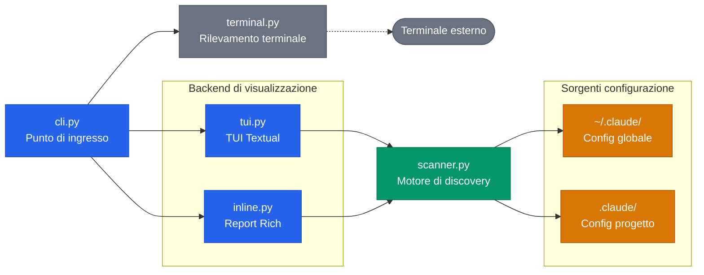
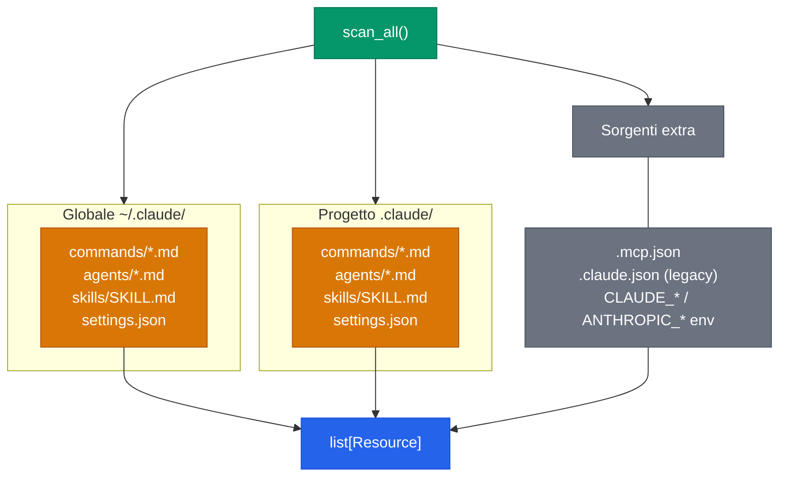
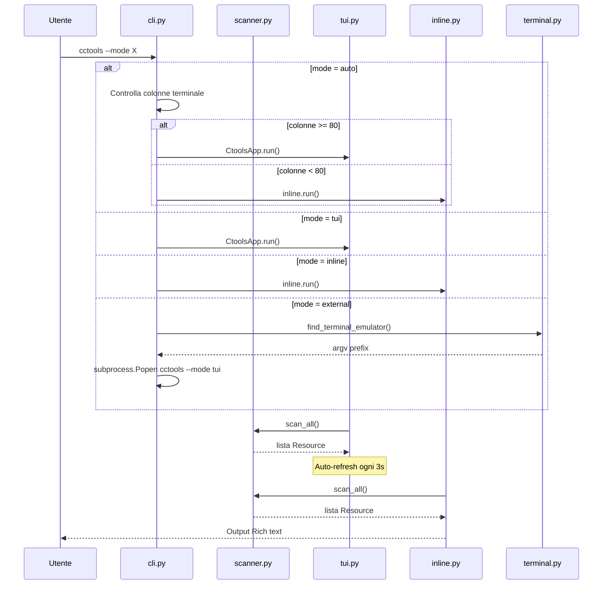

# Architettura

Documentazione tecnica degli internals di cctools. Per l'utilizzo, vedi il [README](../README.it.md).

## Panoramica del sistema

Cinque moduli con separazione netta delle responsabilita: dispatch CLI, discovery del filesystem, e tre backend di visualizzazione.

| Colore | Significato |
|--------|------------|
| Blu | Moduli core (entry point, visualizzazione) |
| Verde | Motore di discovery |
| Ambra | Sorgenti dati di configurazione |
| Grigio | Esterni/dipendenti dalla piattaforma |

## Flusso di discovery dello scanner

`scanner.scan_all()` legge dalle directory di configurazione globale e di progetto, oltre a sorgenti extra (file legacy, variabili d'ambiente). Ogni sorgente produce istanze della dataclass `Resource`, unite in una singola lista ordinata.

Da `settings.json`, lo scanner estrae tre tipi di risorse: server MCP (`mcpServers`), hook (`hooks`) e variabili d'ambiente. Il parser YAML frontmatter e integrato (nessuna dipendenza da PyYAML) e supporta scalari multilinea (`>`, `|`).

## Dispatch delle modalita CLI

`cli.py` instrada verso uno dei tre backend di visualizzazione in base al flag `--mode` o al rilevamento automatico. In modalita auto, la larghezza del terminale determina se avviare la TUI completa o ricadere sull'output testuale inline.

La TUI usa `set_interval(3)` di Textual per il refresh periodico. Ad ogni tick, confronta le fingerprint delle risorse (categoria, nome, scope, sorgente) e ricostruisce l'albero solo quando rileva cambiamenti.

## Pipeline CI

GitHub Actions esegue ad ogni push e PR su main, su una matrice di versioni Python.

```mermaid
%%{init: {'theme': 'default'}}%%
graph LR
    classDef core fill:#2563eb,stroke:#1d4ed8,color:#fff
    classDef engine fill:#059669,stroke:#047857,color:#fff
    classDef data fill:#d97706,stroke:#b45309,color:#fff
    classDef ext fill:#6b7280,stroke:#4b5563,color:#fff

    trigger["Push / PR<br/>su main"]:::ext
    matrix["Matrice<br/>Python 3.10, 3.12, 3.13"]:::ext

    lint["Lint<br/>ruff check + format"]:::core
    test_step["Test<br/>pytest + coverage"]:::engine
    typecheck["Typecheck<br/>mypy"]:::core
    audit["Sicurezza<br/>pip-audit"]:::data
    badges["Badge<br/>solo main"]:::data

    trigger --> matrix
    matrix --> lint
    lint --> test_step
    test_step --> typecheck
    typecheck --> audit
    audit -->|"branch main"| badges
```

La generazione dei badge (conteggio test, percentuale copertura) avviene solo sul branch main e committa file JSON dei badge nel repository.
