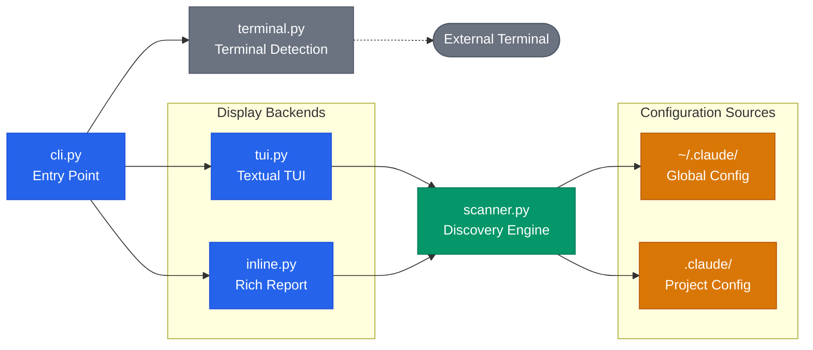
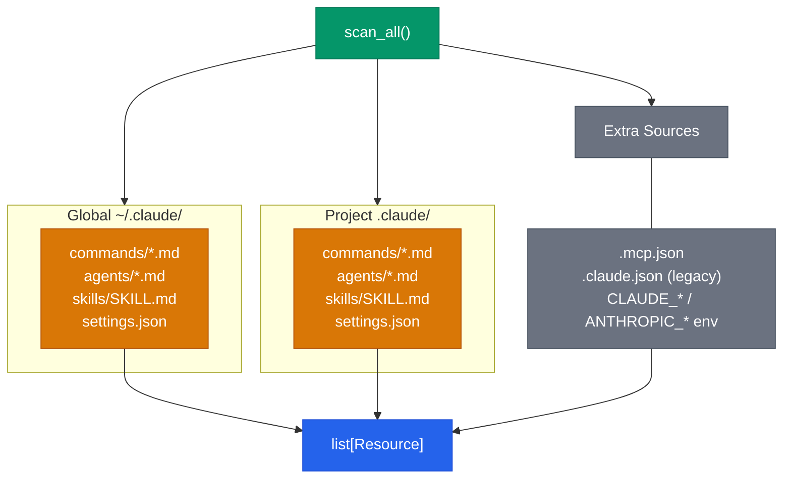
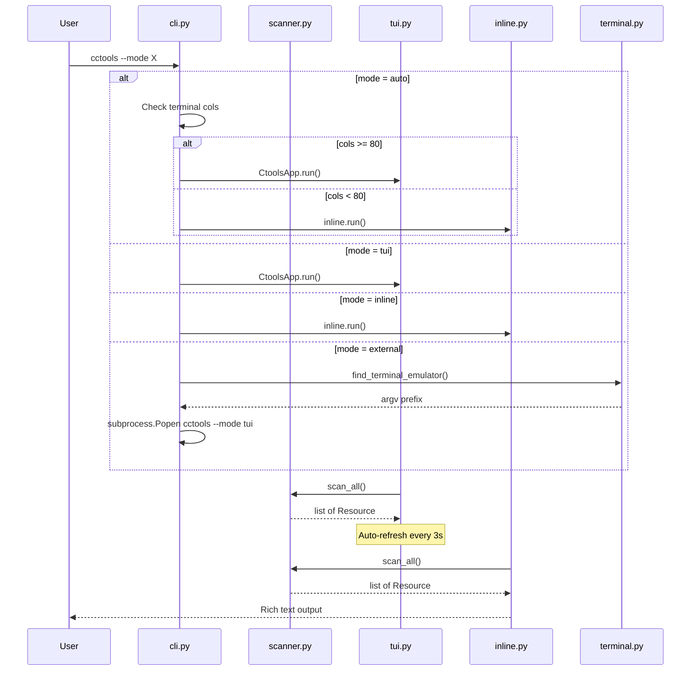

# Architecture

Technical documentation for cctools internals. For usage, see [README](../README.md).

## System Overview

Five modules with clear separation of concerns: CLI dispatch, filesystem discovery, and three display backends.

| Color | Meaning |
|-------|---------|
| Blue | Core modules (entry point, display) |
| Green | Discovery engine |
| Amber | Configuration data sources |
| Gray | External/platform-dependent |

## Scanner Discovery Flow

`scanner.scan_all()` reads from global and project configuration directories, plus extra sources (legacy files, environment variables). Each source produces `Resource` dataclass instances, merged into a single sorted list.

From `settings.json`, the scanner extracts three resource types: MCP servers (`mcpServers`), hooks (`hooks`), and environment variables. The YAML frontmatter parser is built-in (no PyYAML dependency) and supports multiline scalars (`>`, `|`).

## CLI Mode Dispatch

`cli.py` routes to one of three display backends based on `--mode` flag or auto-detection. In auto mode, terminal width determines whether to launch the full TUI or fall back to inline text output.

The TUI uses Textual's `set_interval(3)` for periodic refresh. On each tick, it compares resource fingerprints (category, name, scope, source) and rebuilds the tree only when changes are detected.

## CI Pipeline

GitHub Actions runs on every push and PR to main, across a Python version matrix.

```mermaid
%%{init: {'theme': 'default'}}%%
graph LR
    classDef core fill:#2563eb,stroke:#1d4ed8,color:#fff
    classDef engine fill:#059669,stroke:#047857,color:#fff
    classDef data fill:#d97706,stroke:#b45309,color:#fff
    classDef ext fill:#6b7280,stroke:#4b5563,color:#fff

    trigger["Push / PR<br/>to main"]:::ext
    matrix["Matrix<br/>Python 3.10, 3.12, 3.13"]:::ext

    lint["Lint<br/>ruff check + format"]:::core
    test_step["Test<br/>pytest + coverage"]:::engine
    typecheck["Typecheck<br/>mypy"]:::core
    audit["Security<br/>pip-audit"]:::data
    badges["Badges<br/>main only"]:::data

    trigger --> matrix
    matrix --> lint
    lint --> test_step
    test_step --> typecheck
    typecheck --> audit
    audit -->|"main branch"| badges
```

Badge generation (test count, coverage percentage) runs only on the main branch and commits badge JSON files to the repository.
